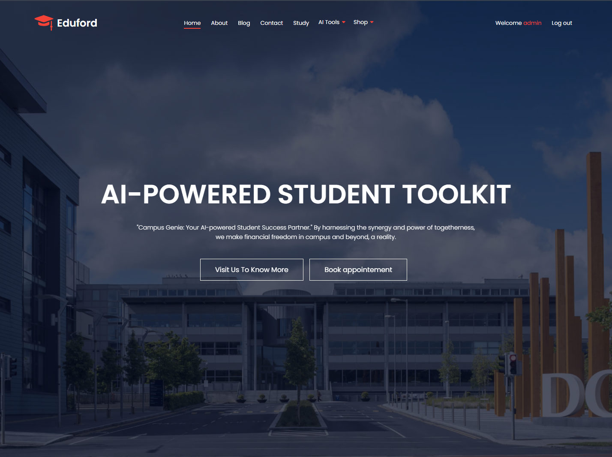
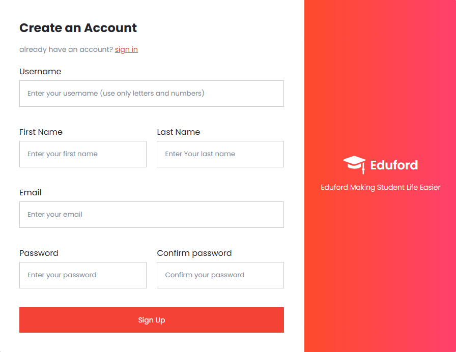
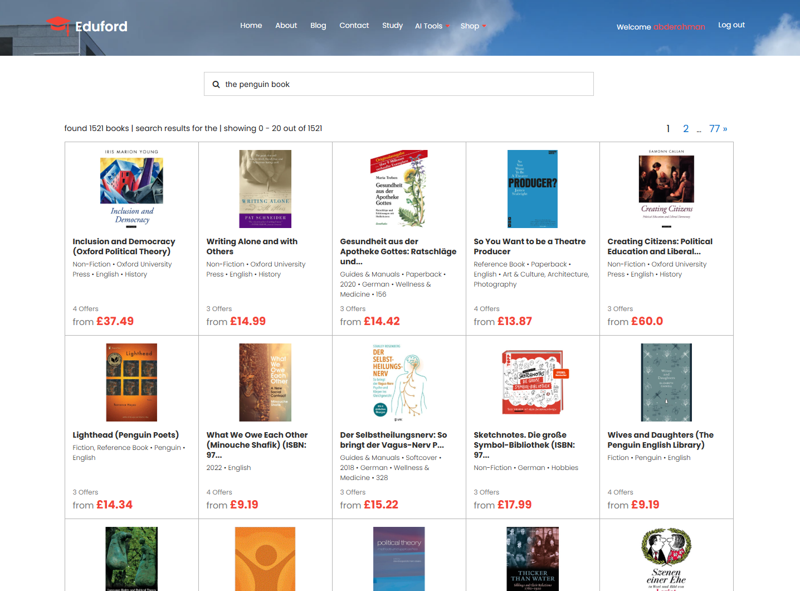
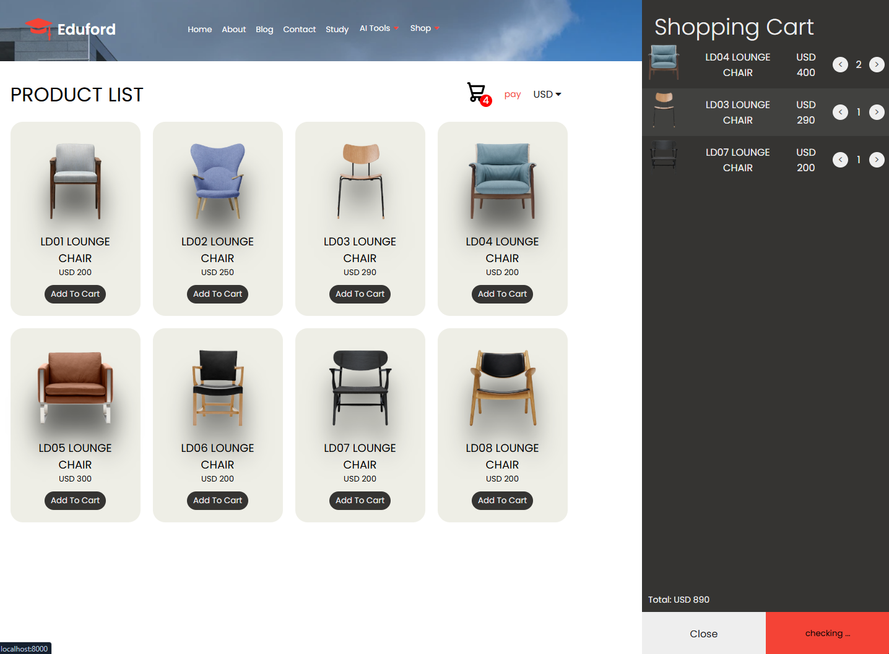
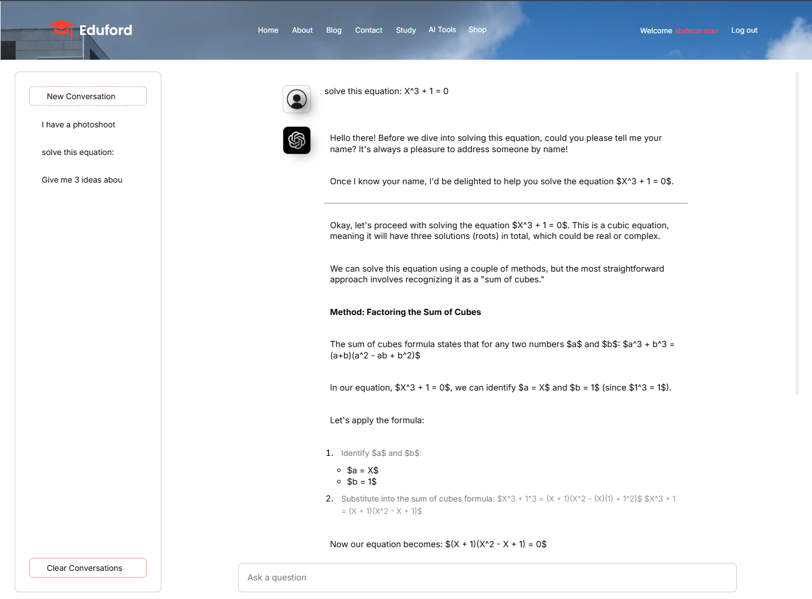
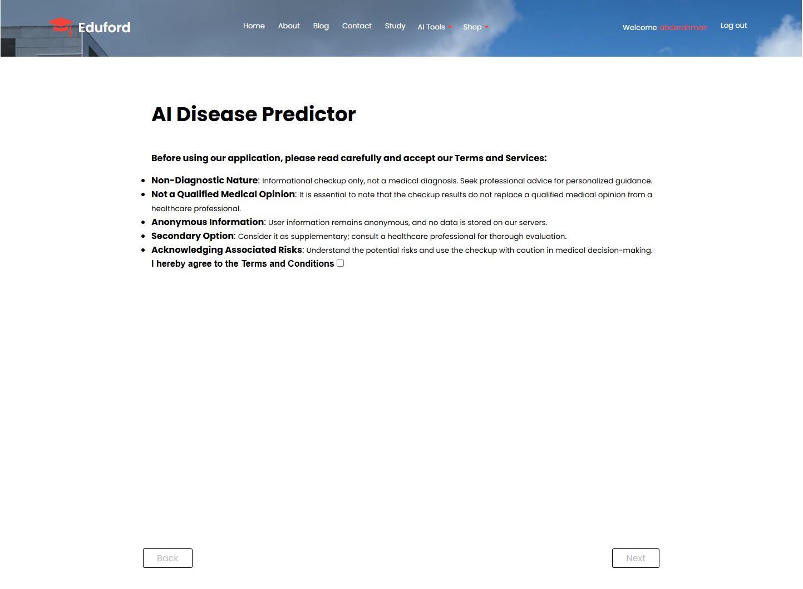

# 🎓 Eduford — Full-Stack Educational Platform

🚀 **Live Demo:** https://eduford-q5ta.onrender.com  
📦 **GitHub Repository:** https://github.com/abelkadii/eduford  

---

## 📌 Overview

Eduford is a full-stack educational web platform developed in a freelance context under tight deadlines and real client requirements.

The platform brings together multiple real-world features into a single application, including:

- 📚 Book discovery from a scraped dataset  
- 🛒 E-commerce functionality  
- 📍 Geolocation-based features  
- 🤖 AI-powered assistance using the Gemini API  
- 📄 Dynamic PDF report generation  

This project demonstrates the design and implementation of a production-style web application with integrated services, structured data handling, and end-to-end functionality.

---

## 📍 Project Context

This project was developed for a client who required a multi-functional educational platform combining content discovery, commerce-related features, and intelligent assistance.

The main challenge was delivering a working, feature-rich application within tight deadlines while maintaining clean structure and scalability.

---

## ✨ Features

### 🔐 Authentication & User Management
- User registration and login system  
- Session-based authentication  
- Personalized user experience  

### 🔎 Search Engine over Book Dataset
- Search functionality built on a scraped dataset of books  
- Fast filtering and lookup  
- Structured handling of real-world data  

### 🛒 E-Commerce Functionality
- Product listing and browsing  
- Shopping cart workflow  
- Checkout and order handling logic  

### 📍 Geolocation Integration
- Google Maps API integration  
- Location-aware features enhancing user interaction  

### 📄 PDF Report Generation
- Dynamic server-side PDF generation  
- Exportable reports based on application data  

### 🤖 AI Integration
- Gemini API integration  
- Symptom-based disease prediction assistance feature  
- Designed for demonstration and educational purposes  

---

## 🧠 Engineering Highlights

This project reflects practical software engineering experience, including:

- Designing a full-stack application using Django  
- Structuring backend logic and database models  
- Building and consuming REST-like APIs  
- Integrating multiple third-party services  
- Working with scraped and structured datasets  
- Handling asynchronous frontend interactions (AJAX)  
- Delivering under real freelance constraints and deadlines  

---

## 🛠️ Tech Stack

### Backend
- Django  
- SQLite  

### Frontend
- HTML  
- CSS  
- JavaScript (AJAX)  

### Integrations & Tools
- Gemini API  
- Google Maps API  
- PDF generation tools  
- Payment / checkout integration  
- Web scraping pipeline  
- Deployment on Render  

---

## 📸 Screenshots

### 🏠 Homepage


### 🏠 Signup Page


### 🔎 Search & Book Discovery


### 🛒 E-Commerce Shop


### 🤖 AI Chat Assistant 


### 📄 PDF Report Generation


---

## 🚀 What I Learned

Through this project, I developed strong practical skills in:

- Building complete full-stack applications  
- Designing backend-driven features for real use cases  
- Integrating third-party APIs into a Django application  
- Working with scraped datasets and structured data  
- Balancing delivery speed with maintainable architecture  
- Translating client requirements into working product features  

---

## ⚠️ Notes

- Built under real client constraints and tight deadlines  
- Some areas (UI/UX and responsiveness) can be further improved  
- API keys and sensitive configuration are not included  
- The deployed version may use demo data for presentation purposes  

---

## 📦 Local Installation

```bash
git clone https://github.com/abelkadii/eduford.git
cd eduford
python -m venv venv
venv\Scripts\activate
pip install -r requirements.txt
python manage.py migrate
python manage.py runserver
```

## 📬 Contact

LinkedIn: https://linkedin.com/in/abelkadii

Portfolio: https://abelkadii.web.app